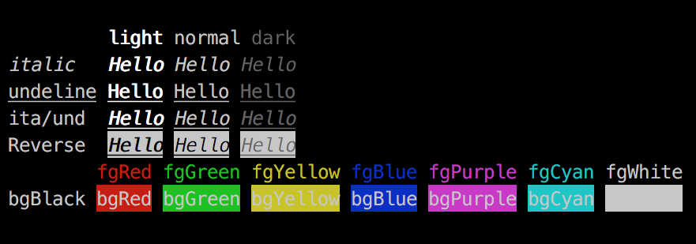

# Chalk

Bring colors to Ballerina programs.



## Supported colors

1. Black
2. Red
3. Green
4. Yellow
5. Blue
6. Purple
7. Cyan
8. White

## Supported text properties

1. Underline
2. Italicize
3. Reverse (background and foreground colors)
4. Dark color mode
5. Light color mode

## Sample

First, import the chalk package.

```ballerina
import shan1024/chalk;
```

Create a new `chalk` object. The first argument is the foreground color and the second argument is the background color.

```ballerina
chalk:Chalk chalk = new(chalk:WHITE, chalk:RED);
```

You can make the text italicized and underlined as well through default-able parameters.

```ballerina
chalk:Chalk chalk = new(chalk:WHITE, chalk:RED, italicize = true, underline = true);
```

Start colorizing your texts.

```ballerina
string colorizedText = chalk.write("Hello world !!!");
io:println(colorizedText);

```

Chained actions are supported.

```ballerina
string colorizedText = chalk.dark().italicize().reverse().write("Hello world !!!");
io:println(colorizedText);

```

So you can customize the chalk any way you want. Cool, right !!! ;)


[Inspired by the node module with the same name]
